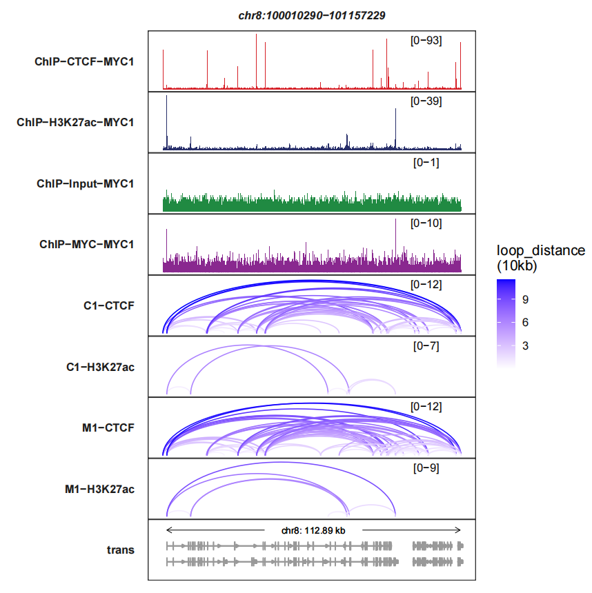
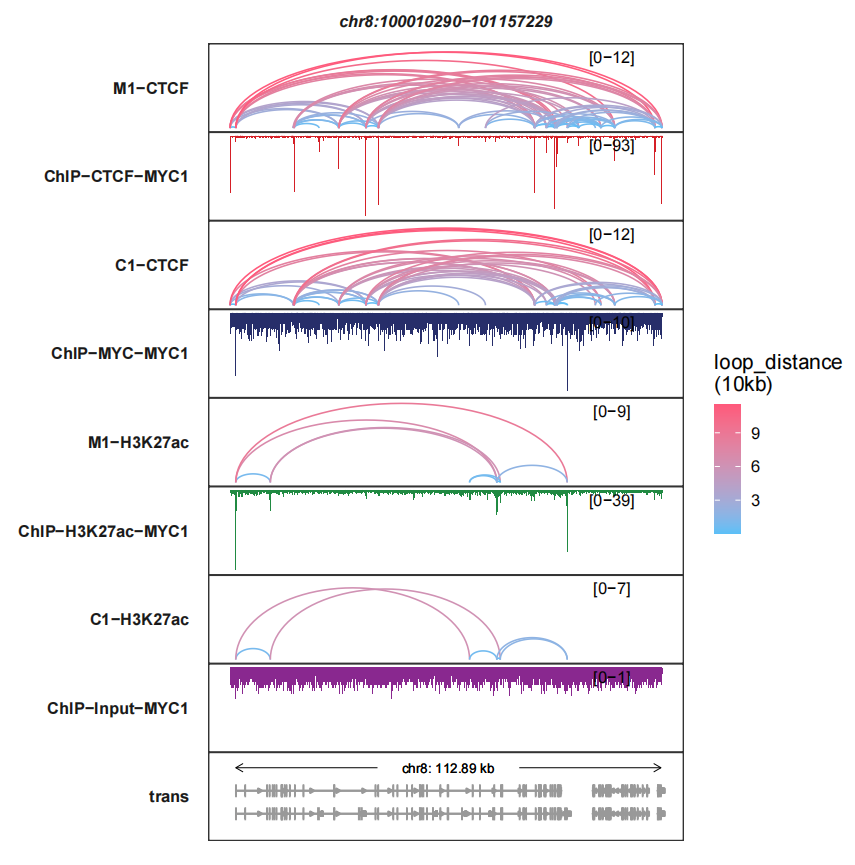
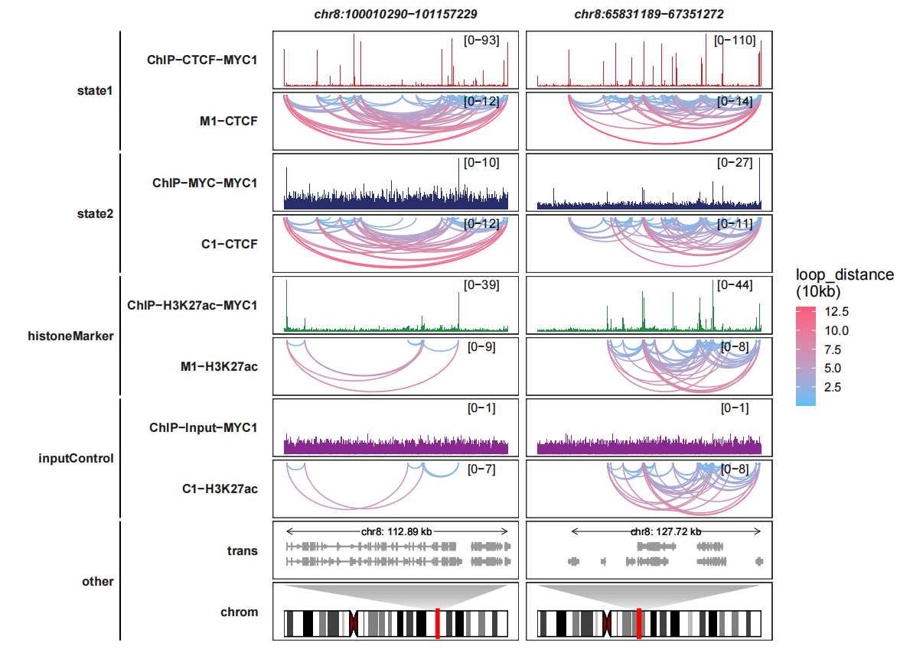
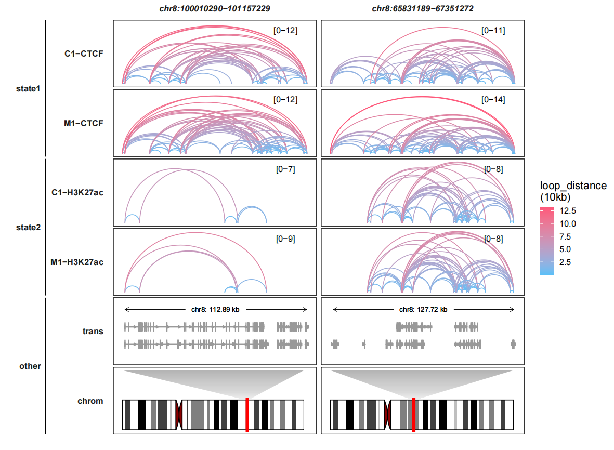

# Loops visualization

For **Hi-C**, **HiChIP** and **ChIA-PET** sequencing technologies, them aim to 
catch the three dimension interaction of chromosomes. Finding interaction sites
and visualize them which are on demand. Usually we use arch links to represent the
interaction information. 

## Input data prepration

> Test data can be fetched on [**GSE200165**](https://www.ncbi.nlm.nih.gov/geo/query/acc.cgi?acc=GSE200165).

We can use **loadloops** function to load the interaction sites data:

```{r fig.align='center',eval=FALSE}
loop_file <- list.files("test-bw2/",pattern = ".bedpe$",full.names = T)
loop_file
# [1] "test-bw2/C1-CTCF.bedpe"    "test-bw2/C1-H3K27ac.bedpe" "test-bw2/M1-CTCF.bedpe"   
# [4] "test-bw2/M1-H3K27ac.bedpe"

file_name = c("C1-CTCF","C1-H3K27ac","M1-CTCF","M1-H3K27ac")

# test code
loop_data <- loadloops(loop_file = loop_file,file_name = file_name,
                       sep = " ")

# check
head(loop_data,3)

#   seqnames     start       end    score fileName
# 1    chr10 100002774 100022436 0.021354  C1-CTCF
# 2    chr10 100002774 100069170 0.068404  C1-CTCF
# 3    chr10 100002774 100185646 0.184670  C1-CTCF
```

---

> Test data can be fetched on [**GSE200160**](https://www.ncbi.nlm.nih.gov/geo/query/acc.cgi?acc=GSE200160).

Here we also load bigwig data:

```{r fig.align='center',eval=FALSE}
# bigwig
file <- list.files(path = "test-bw2/",pattern = '.bw',full.names = T)
# [1] "test-bw2/ChIP-CTCF-MYC1.bw"    "test-bw2/ChIP-H3K27ac-MYC1.bw" "test-bw2/ChIP-Input-MYC1.bw"  
# [4] "test-bw2/ChIP-MYC-MYC1.bw"

bw <- loadBigWig(bw_file = file,chrom = "8")
bw$seqnames <- paste("chr",bw$seqnames,sep = "")

# gtf
gtf <- rtracklayer::import.gff("test-bw2/hg19.ncbiRefSeq.gtf.gz",format = "gtf") %>% 
  data.frame() 
```

## Basic loops visualization

The legend **score** means the distance across two interaction sites. The higher score,
the longer distance:

```{r fig.align='center',eval=FALSE}
trackVisProMax(Input_bw = bw,
               Input_gtf = gtf,
               query_region = list(query_chr = "chr8",
                                   query_start = 100010290,
                                   query_end = 101157229),
               Input_loop = loop_data,
               fixed_column_range = F)
```
{width=100%}


**loops_col** controls the color or links:

```{r fig.align='center',eval=FALSE}
trackVisProMax(Input_bw = bw,
               Input_gtf = gtf,
               query_region = list(query_chr = "chr8",
                                   query_start = 100010290,
                                   query_end = 101157229),
               Input_loop = loop_data,
               fixed_column_range = F,
               loops_col = c("white","blue"))
```
{width=100%}

**signal_layer_loop_params** accepts a named list to control the links layer,
For more details, please check **ggbio::geom_arch**. Here we turn off the legend:

```{r fig.align='center',eval=FALSE}
trackVisProMax(Input_bw = bw,
               Input_gtf = gtf,
               query_region = list(query_chr = "chr8",
                                   query_start = 100010290,
                                   query_end = 101157229),
               Input_loop = loop_data,
               fixed_column_range = F,
               loops_col = c("white","blue"),
               signal_layer_loop_params = list(show.legend = F))
```
{width=100%}

**max.height** can make the links panel height to be same:

```{r fig.align='center',eval=FALSE}
trackVisProMax(Input_bw = bw,
               Input_gtf = gtf,
               query_region = list(query_chr = "chr8",
                                   query_start = 100010290,
                                   query_end = 101157229),
               Input_loop = loop_data,
               fixed_column_range = F,
               signal_layer_loop_params = list(max.height = 12))
```
{width=100%}

**linewidth** changes the links linewidth:

```{r fig.align='center',eval=FALSE}
trackVisProMax(Input_bw = bw,
               Input_gtf = gtf,
               query_region = list(query_chr = "chr8",
                                   query_start = 100010290,
                                   query_end = 101157229),
               Input_loop = loop_data,
               fixed_column_range = F,
               signal_layer_loop_params = list(linewidth = 1))
```
{width=100%}

We can arrange the sample order:

```{r fig.align='center',eval=FALSE}
trackVisProMax(Input_bw = bw,
               Input_gtf = gtf,
               query_region = list(query_chr = "chr8",
                                   query_start = 100010290,
                                   query_end = 101157229),
               Input_loop = loop_data,
               fixed_column_range = F,
               sample_order = c("M1-CTCF","ChIP-CTCF-MYC1",
                                "C1-CTCF","ChIP-MYC-MYC1",
                                "M1-H3K27ac","ChIP-H3K27ac-MYC1",
                                "C1-H3K27ac","ChIP-Input-MYC1"))
```
{width=100%}

## Reverse Y axis

**reverse_y_vars** allows you to reverse the Y axis for any signal track,
you only need to give a track character name:

```{r fig.align='center',eval=FALSE}
trackVisProMax(Input_bw = bw,
               Input_gtf = gtf,
               query_region = list(query_chr = "chr8",
                                   query_start = 100010290,
                                   query_end = 101157229),
               Input_loop = loop_data,
               fixed_column_range = F,
               sample_order = c("ChIP-CTCF-MYC1","M1-CTCF",
                                "ChIP-MYC-MYC1","C1-CTCF",
                                "ChIP-H3K27ac-MYC1","M1-H3K27ac",
                                "ChIP-Input-MYC1","C1-H3K27ac"),
               reverse_y_vars = c("M1-CTCF","C1-CTCF",
                                  "M1-H3K27ac","C1-H3K27ac"))
```
{width=100%}

Or you can reverse the bigwig track Y axis:

```{r fig.align='center',eval=FALSE}
trackVisProMax(Input_bw = bw,
               Input_gtf = gtf,
               query_region = list(query_chr = "chr8",
                                   query_start = 100010290,
                                   query_end = 101157229),
               Input_loop = loop_data,
               fixed_column_range = F,
               sample_order = c("M1-CTCF","ChIP-CTCF-MYC1",
                                "C1-CTCF","ChIP-MYC-MYC1",
                                "M1-H3K27ac","ChIP-H3K27ac-MYC1",
                                "C1-H3K27ac","ChIP-Input-MYC1"),
               reverse_y_vars = c("ChIP-CTCF-MYC1","ChIP-MYC-MYC1",
                                  "ChIP-H3K27ac-MYC1","ChIP-Input-MYC1"))
```
{width=100%}

Let's draw multiple genomic regions:

```{r fig.align='center',eval=FALSE}
trackVisProMax(Input_bw = bw,
               Input_gtf = gtf,
               query_region = list(query_chr = c("chr8","chr8"),
                                   query_start = c(100010290,65831189),
                                   query_end = c(101157229,67351272)),
               Input_loop = loop_data,
               fixed_column_range = F,
               sample_order = c("ChIP-CTCF-MYC1","M1-CTCF",
                                "ChIP-MYC-MYC1","C1-CTCF",
                                "ChIP-H3K27ac-MYC1","M1-H3K27ac",
                                "ChIP-Input-MYC1","C1-H3K27ac"),
               reverse_y_vars = c("M1-CTCF","C1-CTCF",
                                  "M1-H3K27ac","C1-H3K27ac"))
```
{width=100%}

## Combing with chromosome track

Adding chromosome tracks:

```{r fig.align='center',eval=FALSE}
data("hg19_obj")
trackVisProMax(Input_bw = bw,
               Input_gtf = gtf,
               query_region = list(query_chr = c("chr8","chr8"),
                                   query_start = c(100010290,65831189),
                                   query_end = c(101157229,67351272)),
               Input_loop = loop_data,
               fixed_column_range = F,
               sample_order = c("ChIP-CTCF-MYC1","M1-CTCF",
                                "ChIP-MYC-MYC1","C1-CTCF",
                                "ChIP-H3K27ac-MYC1","M1-H3K27ac",
                                "ChIP-Input-MYC1","C1-H3K27ac"),
               reverse_y_vars = c("M1-CTCF","C1-CTCF",
                                  "M1-H3K27ac","C1-H3K27ac"),
               draw_chromosome = T,
               draw_chromosome_params = list(ideogram_obj = hg19_obj))
```
{width=100%}

Adding group information:

```{r fig.align='center',eval=FALSE}
trackVisProMax(Input_bw = bw,
               Input_gtf = gtf,
               query_region = list(query_chr = c("chr8","chr8"),
                                   query_start = c(100010290,65831189),
                                   query_end = c(101157229,67351272)),
               Input_loop = loop_data,
               fixed_column_range = F,
               sample_order = c("ChIP-CTCF-MYC1","M1-CTCF",
                                "ChIP-MYC-MYC1","C1-CTCF",
                                "ChIP-H3K27ac-MYC1","M1-H3K27ac",
                                "ChIP-Input-MYC1","C1-H3K27ac"),
               reverse_y_vars = c("M1-CTCF","C1-CTCF",
                                  "M1-H3K27ac","C1-H3K27ac"),
               draw_chromosome = T,
               draw_chromosome_params = list(ideogram_obj = hg19_obj),
               sample_group_info = list(state1 = c("ChIP-CTCF-MYC1","M1-CTCF"),
                                        state2 = c("ChIP-MYC-MYC1","C1-CTCF"),
                                        histoneMarker = c("ChIP-H3K27ac-MYC1","M1-H3K27ac"),
                                        inputControl = c("ChIP-Input-MYC1","C1-H3K27ac")),
               panel.spacing = c(0.2,0.2))
```
{width=100%}

## Higlight regions

Adding highlight regions:

```{r fig.align='center',eval=FALSE}
higlight_region <- list("chr8:100010290-101157229" = list(start = c(100310290),
                                                          end = c(100457229)),
                        "chr8:65831189-67351272" = list(start = c(65931189,66231189),
                                                        end = c(66051272,66351272)))

higlight_col <- list(Actb = c("purple"),
                     Myc = c("yellow","green"))

trackVisProMax(Input_bw = bw,
               Input_gtf = gtf,
               query_region = list(query_chr = c("chr8","chr8"),
                                   query_start = c(100010290,65831189),
                                   query_end = c(101157229,67351272)),
               Input_loop = loop_data,
               fixed_column_range = F,
               sample_order = c("ChIP-CTCF-MYC1","M1-CTCF",
                                "ChIP-MYC-MYC1","C1-CTCF",
                                "ChIP-H3K27ac-MYC1","M1-H3K27ac",
                                "ChIP-Input-MYC1","C1-H3K27ac"),
               reverse_y_vars = c("M1-CTCF","C1-CTCF",
                                  "M1-H3K27ac","C1-H3K27ac"),
               draw_chromosome = T,
               draw_chromosome_params = list(ideogram_obj = hg19_obj),
               sample_group_info = list(state1 = c("ChIP-CTCF-MYC1","M1-CTCF"),
                                        state2 = c("ChIP-MYC-MYC1","C1-CTCF"),
                                        histoneMarker = c("ChIP-H3K27ac-MYC1","M1-H3K27ac"),
                                        inputControl = c("ChIP-Input-MYC1","C1-H3K27ac")),
               panel.spacing = c(0.2,0.2),
               higlight_region = higlight_region,
               higlight_col = higlight_col)
```
{width=100%}

## Drawing only loop tracks

We can only plot loops graph without bigwig track:

```{r fig.align='center',eval=FALSE}
trackVisProMax(Input_gtf = gtf,
               query_region = list(query_chr = c("chr8","chr8"),
                                   query_start = c(100010290,65831189),
                                   query_end = c(101157229,67351272)),
               Input_loop = loop_data,
               fixed_column_range = F,
               draw_chromosome = T,
               draw_chromosome_params = list(ideogram_obj = hg19_obj),
               sample_group_info = list(state1 = c("C1-CTCF","M1-CTCF"),
                                        state2 = c("M1-H3K27ac","C1-H3K27ac")),
               panel.spacing = c(0.2,0.2))
```
{width=100%}

## Curve geoms choosing

The curves are generated based on **ggbio::geom_arch** function. The curves are
a little strange which means the arcs are much oblate. Here we can choose another
geom layer **jjPlot::geom_arch2** for better visualization. Setting 
**Loop_curve_geom = "geom_arch2"**:


```{r fig.align='center',eval=FALSE}
trackVisProMax(Input_gtf = gtf,
               query_region = list(query_chr = c("chr8","chr8"),
                                   query_start = c(100010290,65831189),
                                   query_end = c(101157229,67351272)),
               Input_loop = loop_data,
               fixed_column_range = F,
               draw_chromosome = T,Loop_curve_geom = "geom_arch2",
               draw_chromosome_params = list(ideogram_obj = hg19_obj),
               sample_group_info = list(state1 = c("C1-CTCF","M1-CTCF"),
                                        state2 = c("M1-H3K27ac","C1-H3K27ac")),
               panel.spacing = c(0.2,0.2))
```
{width=100%}

You can just choose suitable style what you like.


